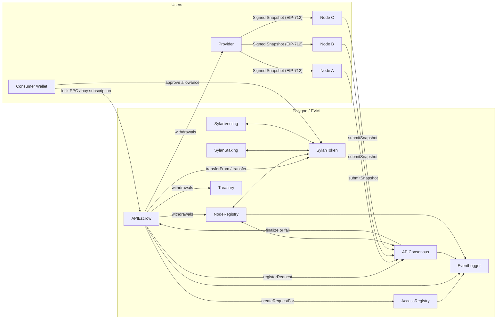
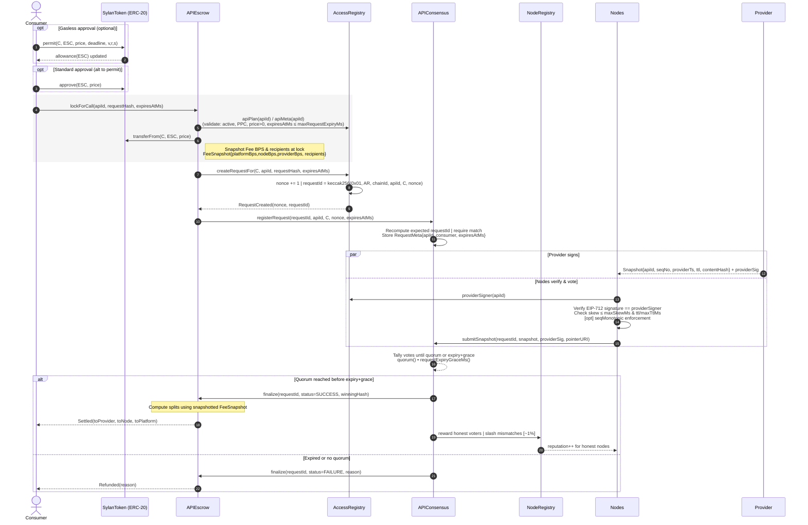
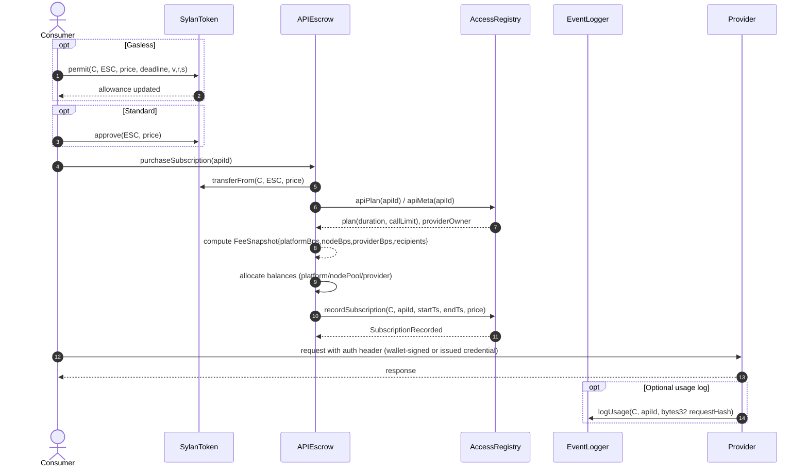
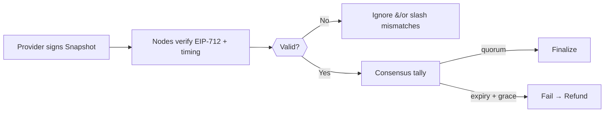
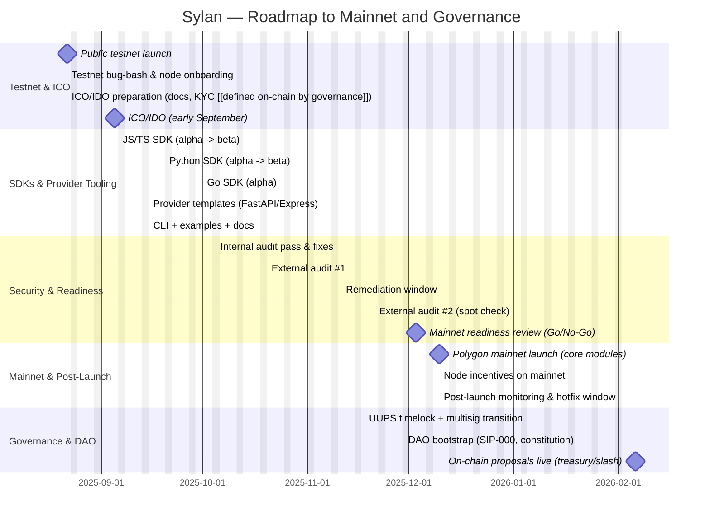

# Sylan Protocol — Whitepaper (v0.1)

> **Positioning.** Sylan is a **protocol** for trust‑minimized API commerce. Providers define plans in **AccessRegistry**; consumers lock **SYL** in **APIEscrow** (PPC or Subscriptions); provider‑signed EIP‑712 **Snapshots** are tallied by **APIConsensus**; on success funds split to **Provider / NodePool / Platform**, otherwise **refunds** apply. **NodeRegistry** governs node lifecycle and slashing; **EventLogger** provides an authorized audit trail.

_Last updated: 2025-08-17

---

## 1. Overview

### 1.1 Introduction — Why Sylan, Why Now
APIs are the backbone of modern software, yet the economics and trust of API access remain largely **Web2**: opaque pricing, account-bound keys, centralized billing, fragile rate limits, and unverifiable data freshness. When API payloads are used to trigger financial actions (trading, credit scoring, insurance underwriting, oracle inputs), “best-effort” access and unverifiable responses are **not** good enough.

**Sylan** is a **decentralized API marketplace protocol** that upgrades API commerce from account/key + invoice to **request-scoped, cryptographically attestable access with on-chain settlement**. Providers define plans on-chain; consumers lock SYL per request or purchase subscriptions; nodes verify **provider-signed** snapshots and reach quorum; funds split automatically on success or refund on failure. Every step is auditable.

### 1.2 What brought us here (the problem with Web2 APIs)
- **Trust gap:** Consumers cannot prove that “this exact data” came from “that provider” at a specific time, within a freshness window.
- **Single point of failure:** Keys/accounts get throttled or suspended; outages become business-critical incidents.
- **Opaque settlement:** Prepaid credits and invoices lack verifiable, per-request settlement and fair revenue share for infrastructure actors.
- **Data integrity vs. cost:** Running bespoke bridges/oracles is expensive and error-prone; most teams re-implement the same plumbing.
- **Incentives misaligned:** Honest intermediaries (nodes) have weak incentives; dishonest behavior is rarely penalized.

### 1.3 Sylan’s thesis
If API access is **tokenized per request** and its **result is attested** by the provider and **voted** by independent nodes under **economic incentives**, then:
- Consumers get **verifiable** responses (source + freshness + contentHash).
- Providers get **instant, programmatic settlement** with transparent fee splits.
- Nodes are rewarded for honest work and **slashed** for mismatches.
- The marketplace can coordinate access at internet scale without a trusted operator.

### 1.4 What Sylan solves (at a glance)
- **Provable provenance & freshness** — Provider EIP-712 **Snapshots** `{apiId, seqNo, providerTs, ttl, contentHash}` tie data to time and source; nodes enforce skew/TTL and tally outcomes.
- **Deterministic request domain** — `requestId = keccak256(0x01, registry, chainId, apiId, consumer, nonce)` removes ambiguity per consumer/API.
- **Automatic, fair settlement** — On success, funds split **Provider / NodePool / Platform**; on failure or expiry, **refund**.
- **Composable access** — Pay-Per-Call (**PPC**) for single requests; **Subscription** for longer-lived usage with optional call limits.
- **Security-first operations** — **Slashing** for bad votes; **Pausable/UUPS** upgrades; **EventLogger** for an authorized audit trail.

### 1.5 Who benefits
- **API Providers:** List once, set price/terms on-chain, receive automatic settlement, gain cryptographic proof that customers consumed your data as sold.
- **Consumers (devs, protocols, enterprises):** Swap API keys and invoices for **verifiable** access with predictable cost, refunds on failure, and on-chain receipts.
- **Node Operators:** Earn from honest voting; build reputation; face clear penalties for misbehavior, aligning incentives with data quality.
- **Integrators & app platforms:** Compose Sylan as an **access/settlement primitive** without running bespoke bridges or oracles.

### 1.6 Protocol in one page (on-chain surfaces)
- **AccessRegistry** — Listings & plans (Subscription or Pay-Per-Call), API descriptor, consumer nonces, canonical `requestId`, per-API timing caps (e.g., max request expiry).
- **APIEscrow** — Locks SYL for PPC, purchases subscriptions, **snapshots fee BPS at lock**, calls `createRequestFor(...)` then `Consensus.registerRequest(...)`, later settles or refunds; pull-based `withdraw()`.
- **APIConsensus** — Verifies provider-signed **Snapshots**, collects node votes, applies quorum + grace, **finalize/fail**; mismatched votes are slashable.
- **NodeRegistry** — Register/stake/unbond; **slash distribution** (Treasury / NodePool / Burn) summing to **10,000 BPS**; reputation hooks.
- **EventLogger** — Authorized audit trail for API lifecycle events.

### 1.7 Value to the ecosystem
- **Credible neutrality:** Rules live in contracts; neither buyers nor sellers rely on a single operator’s discretion.
- **Cost transparency:** Per-request economics are clear; fee splits are immutable per lock (snapshotted).
- **Programmability:** On-chain receipts and settlement enable downstream automation (revenue share, tax, affiliate splits) without custom ops work.
- **Security & resilience:** Multiple nodes, economic incentives, and cryptographic attestations reduce single-point-of-failure risk.
- **Interoperability:** Works across dApps, data pipelines, and off-chain systems as a common **access + settlement** layer.

### 1.8 What this whitepaper covers next
- The **architecture** (modules, actors, boundaries),
- The **request lifecycle** for **PPC** and **Subscription**,
- The **attestation model** (EIP-712 snapshots, time windows),
- **Fees, settlement, slashing, and staking** mechanics,
- **Tokenomics, upgrades, and risk** considerations.

> [!NOTE] Precision first
> Throughout, parameters that are not hard-coded are provided as **\[bracketed defaults]** so operators can tune them without changing the model.

---

## 2. Architecture

### 2.1 System Map



### 2.2 Trust & Data Boundaries

- **On-chain (authoritative):** plans, subscription windows, fee snapshots, request metadata (`requestId`, `expiresAtMs`), tallies and outcomes, balances and withdrawals.
- **Off-chain (verifiable):** API payloads; provider’s EIP-712 **Snapshot** (`apiId, seqNo, providerTs, ttl, contentHash`) and optional pointer URI; node fetching and voting.
- **Security levers:** staking + slashing, quorum, freshness windows (`maxSkewMs`, `ttl`), pause + UUPS upgrades.

### 2.3 Actors

- **Providers:** Publish descriptors, set plans & signer, produce Snapshots.
- **Consumers:** Lock/purchase via Escrow; for subscriptions create/ register per-call requests; read finalized content.
- **Nodes:** Verify provider signatures and freshness; submit votes; are rewarded/slashed via NodeRegistry.
- **Protocol Treasury:** Receives a portion of fees and slashes.
- **Marketplace dApp:** UX/orchestration; no privileged role in settlement.

---

## 3. On‑Chain Modules

### 3.1 AccessRegistry

- **Plans**: `Subscription | PayPerCall` with `price`, `duration (sub)`, `callLimit`, `active`.
- **Meta**: `providerOwner`, `providerSigner`, `seqMonotonic`, `maxSkewMs`, `maxTtlMs`, `active`.
- **Request ID**: deterministic across the registry + chain:

  ```text
  requestId = keccak256(0x01, address(AccessRegistry), chainId, apiId, consumer, nonce)
  ```

- **Expiry cap**: `expiresAtMs` ∈ (now, now+`maxRequestExpiryMs`], default **60,000 ms**.
- **Subscriptions**: ledger (`subscriptionEndsAt`), optional `remainingCalls` (if `callLimit > 0`).

### 3.2 APIEscrow

- **PPC**: Pull SYL (`price`), `createRequestFor(...)` on Registry, **snapshot Fee BPS & recipients**, then `Consensus.registerRequest(...)`.
- **Subscriptions**: Pull SYL and immediately **split** to Provider/NodePool/Platform; record subscription window.
- **Settlement**: After Consensus finalization, `settleSuccess` splits; on failure/expiry `settleFailure` refunds (pull‑based `withdraw()` for recipients).

### 3.3 APIConsensus

- **Snapshot (EIP‑712)**: `{{ apiId, seqNo, providerTs, ttl, contentHash }}` + `providerSig` (from `providerSigner`).
- **Lifecycle**: `registerRequest` → node submissions → `finalize` success or fail after grace.
- **Config**: exposes `quorum()` and `requestExpiryGraceMs()` (≤ 5 minutes).

### 3.4 NodeRegistry

- **Status**: `Active | Unbonding | Inactive` with unbonding period and min stake.
- **Slashing**: Mismatched voters slashed (default **[1%]**); distribution **must sum to 10,000 BPS** (Treasury / NodePool / Burn).
- **Reputation**: `increaseReputation(node, amount)` callable by Consensus.

### 3.5 EventLogger

- **Authorized‑only** audit logging for protocol‑level API events.

---

## 4. Request Lifecycle

Each request is uniquely identified by a deterministic `requestId` to bind **AccessRegistry**, **chain**, **apiId**, **consumer**, and **nonce**:

```
requestId = keccak256(
  0x01 || AccessRegistryAddress || chainid || apiId || consumer || nonce
)
```

- `nonce = consumerNonce[consumer][apiId]` (incremented upon creation).
- The Escrow path uses `createRequestFor(consumer, ...)` to ensure the correct consumer is embedded.

### 4.1 Pay-Per-Call (PPC)

**Intent.** Single request, single settlement. Consumer locks `price` in **APIEscrow**; nodes attest the provider-signed Snapshot; funds split on success or refund on failure.

**Pre-flight (validated by Escrow/Registry)**
- Plan is **active** and **PayPerCall**, `price > 0`.
- `expiresAtMs` is in the future and `<= maxRequestExpiryMs` (default **60,000 ms**).
- Consumer has allowance (via `approve` or `permit`) for `price`.

**Deterministic ID (restate)**
```text
requestId = keccak256(0x01, AccessRegistryAddress, chainId, apiId, consumer, nonce)
```
**Flow (high level)**
1.  Consumer → **APIEscrow.lockForCall(apiId, requestHash, expiresAtMs)**

2.  Escrow pulls SYL and **snapshots Fee BPS & recipients**.

3.  Escrow → **AccessRegistry.createRequestFor(consumer, ...)** ⇒ emits `RequestCreated(nonce, requestId)`

4.  Escrow → **APIConsensus.registerRequest(requestId, ...)**

5.  Provider signs off-chain **Snapshot** `{apiId, seqNo, providerTs, ttl, contentHash}`; nodes verify & vote.

6.  **APIConsensus** tallies: quorum → **finalize SUCCESS**, else after expiry+grace → **finalize FAILURE**.

7.  **APIEscrow**: SUCCESS → **settle** (Provider / NodePool / Platform), FAILURE → **refund** consumer.

8.  Recipients (or consumer) **withdraw()** pull-based.



### 4.2 Subscription

1. Consumer calls `purchaseSubscription(apiId)` in **APIEscrow** (pulls `price`).
2. **APIEscrow** immediately allocates fees (snapshotted BPS).
3. **AccessRegistry** `recordSubscription(consumer, apiId, startTs, endTs, amountPaid)`.
4. Off-chain usage during the window; **no Consensus**; optional **EventLogger** logs.



---

## 5. EIP‑712 Snapshots & Freshness

**Snapshot fields:** `{{ apiId, seqNo, providerTs, ttl, contentHash }}`.

**Validation:**

- `providerSig` must verify against `providerSigner` in AccessRegistry.
- **Freshness**: node checks `providerTs` is within `maxSkewMs` and data not expired (`ttl`, optionally bounded by `maxTtlMs`).
- **Fork choice**: if `seqMonotonic = true` → enforce non‑decreasing `seqNo` on finalize.



---

## 6. Fees & Settlement

On PPC success, Escrow splits the locked `price` using the **snapshotted** Fee BPS (at lock):

```

toPlatform = price * platformBps / 10_000
toNode     = price * nodeBps     / 10_000
toProvider = price - toPlatform - toNode

```

**Table — Fee Split:**

| Recipient  | Share (BPS) | Share (%) | Notes |
|------------|------------:|----------:|-------|
| Platform   | 500         | [5%]      | Operations, audits, dev |
| Node Pool  | 2500        | [25%]     | Honest voter rewards |
| Provider   | 7000        | [70%]     | API revenue |
| **Total**  | **10,000**  | **100%**  | Total bps 10,000 |

---

## 7. Slashing & Reputation

Sylan aligns node behavior with data quality by **rewarding honest votes** and **slashing mismatches**. Slashing is *economic*, applied against a node’s bonded stake; rewards are credited to withdrawable balances. Reputation provides a lightweight, up‑only signal for honest participation and may be used by frontends or off‑chain selection logic.

> [!NOTE] Scope
> - **Who triggers slashing?** The **APIConsensus** contract determines mismatches during `finalize(...)` and calls into **NodeRegistry** to slash offenders and reward honest voters.
> - **Distribution constraint:** In **NodeRegistry**, `treasuryBps + nodePoolBps + burnBps = 10_000` (BPS). This is enforced per slash event.
> - **Defaults:** Unless otherwise configured, the **per‑offense slash** is **[1%]** of the node’s active stake.

### 7.1 When slashing applies
Slashing is applied per **request** to nodes that submit a vote which does **not** match the finalized result, or violates basic checks:
- **Mismatched vote:** Submitted `contentHash` differs from the winning hash for `requestId`.
- **Invalid signature:** Snapshot signature does not verify against `providerSigner(apiId)`.
- **Freshness violation:** Snapshot fails time checks (skew or TTL).
- **(Optional) Sequence violation:** If `seqMonotonic` is enabled per API and node votes for a lower `seqNo`.
- **(Policy) No vote / late vote:** *[Optional]* If configured, nodes that fail to participate may receive reduced rewards or no rewards (not a slash by default).

### 7.2 Slash amount and distribution
Let `stake_i` be the misbehaving node’s current staked SYL, and `slashBps` the configured per‑offense rate (basis points). The slash is:
```
slashAmt_i = stake_i * slashBps / 10_000
```
**Allocation (must total 10_000 BPS):**
```
toTreasury = slashAmt_i * treasuryBps / 10_000
toBurn     = slashAmt_i * burnBps     / 10_000
toNodePool = slashAmt_i - toTreasury - toBurn
```
The **Node Pool** portion is added to the reward pool for honest voters of the same request.

### 7.3 Honest voter rewards
On successful finalization:
- Honest voters receive **Node Pool rewards** for that request.
- Rewards are **pull‑based** (`withdraw()`), not auto‑transferred.
- Weighting:
  - **Base:** pro‑rata by stake: `weight_i = stake_i`
  - **Optional:** reputation‑aware weighting: `weight_i = stake_i * f(reputation_i)` where `f(reputation)` could be `[1 + reputation/100]`.

Reward per honest node `i` for a given request:
```
reward_i = nodePoolReward * weight_i / sum(weights_of_honest_voters)
```
Where `nodePoolReward` includes the Node Pool share of **request fees** (PPC success or Subscription purchase) **plus** any `toNodePool` from slashes for this request.

### 7.4 Reputation mechanics
Reputation is an **up‑only** metric managed by **NodeRegistry** upon instruction from **APIConsensus**.
- **Increase on honesty:** `reputation += [1]` per correct vote.
- **No decrease on slash:** Slashing is economic; reputation remains as history of honest participation.
- **Bounds:** `0 <= reputation <= [100]` (soft cap).
- **Usage:** Off‑chain selection heuristics; optional weighting for rewards (see 7.3). On‑chain security does **not** rely solely on reputation.

> [!TIP] Practical tuning
> - Start with reward weighting by **stake only**. Add `[reputation weight]` after mainnet maturity.
> - Keep slash small but meaningful (**[1%]**) to avoid cascading node exits during incidents.

### 7.5 Parameter defaults
| Parameter               | Default | Notes |
|-------------------------|---------------------------:|-------|
| `slashBps`              | **[100]**                  | 1% per mismatching vote |
| `treasuryBps`           | **[5000]**                 | 50% of each slash |
| `nodePoolBps`           | **[4000]**                 | 40% of each slash; returned to honest voters |
| `burnBps`               | **[1000]**                 | 10% burn for deflationary pressure |
| `minStake`              | **[50_000 SYL]**           | NodeRegistry enforcement |
| `unbondingPeriod`       | **[7 days]**               | Withdraw delay to protect against reorgs/incidents |
| `reputationGainPerVote` | **[1]**                    | Honest vote increment |
| `reputationCap`         | **[100]**                  | Soft cap for UI/weighting |

### 7.6 Worked example (numbers)
Assume a PPC request with `price = 100 SYL`. Fee split at lock: Platform **5%**, Node Pool **25%**, Provider **70%**. Three nodes vote; two honest (H1, H2), one mismatching (M1). Stakes: H1=20k SYL, H2=10k SYL, M1=10k SYL. Slash parameters: `slashBps=1%`, slash distribution Treasury 50%, Node Pool 40%, Burn 10%.
1) **Node Pool from fees:** `100 * 0.25 = 25 SYL`.
2) **Slash M1:** `10,000 * 0.01 = 100 SYL` → Treasury 50, Node Pool 40, Burn 10.
3) **Total Node Pool to distribute:** `25 + 40 = 65 SYL`.
4) **Weights (stake‑only):** H1=20k, H2=10k → sum=30k.
   Rewards: H1=`65*(20k/30k)=43.33… SYL`, H2=`21.666… SYL`.
5) **Provider/Platform:** Provider gets `100*0.70=70 SYL`, Platform gets `5 SYL`.
6) **M1 economic loss:** 100 SYL slash; zero reward.

### 7.7 Events and admin surfaces
- **NodeRegistry**
  - `Slashed(node, amount, requestId)`
  - `Rewarded(node, amount, requestId)`
  - `ReputationIncreased(node, delta, reason)`
  - Admin: set `slashBps`, `{treasury,nodePool,burn}Bps` (must sum to 10_000), set `treasuryWallet`, manage unbonding, pause.
- **APIConsensus**
  - Emits `RequestFinalized(requestId, status, winningHash)` and calls NodeRegistry to distribute rewards/slashes for the request.
- **APIEscrow**
  - Holds node pool fee share from PPC or Subscription purchase; rewards are credited to NodeRegistry balances for later `withdraw()`.

### 7.8 Operator guidance
- Maintain accurate time sources (NTP) to avoid skew violations.
- Cache provider descriptors and `providerSigner` to validate snapshots efficiently.
- Use safe RPCs and redundant networking to submit votes promptly.
- Monitor `slashBps` and your **effective risk**; size stake accordingly and diversify across APIs.

---

**Slash Allocation Formula (summary)**

```
toTreasury = slashAmt * treasuryBps / 10_000
toBurn     = slashAmt * burnBps     / 10_000
toNodePool = slashAmt - toTreasury - toBurn
```

**Table — Slash Distribution:**

| Bucket    | BPS    | %   | Where it goes          |
|-----------|-------:|----:|------------------------|
| Treasury  | [5,000] | [50%] | Protocol treasury        |
| Node Pool | [4,000] | [40%] | Rewards to honest voters |
| Burn      | [1,000] | [10%] | Deflationary pressure    |
| **Total** | **10,000** | **100%** | Enforced in NodeRegistry |

---

## 8. Staking & Emissions (SylanStaking)

Single‑asset staking in **SYL**; rewards accrue at `rewardRatePerSecond` with 1e12 precision accounting.

```
pending = amount * accRewardPerShare / 1e12 - rewardDebt
```

**Table — Staking Parameters:**

| Param               | Value              | Source |
|---------------------|-------------------:|--------|
| rewardRatePerSecond | [0.25 SYL/s]       | Config |
| accRewardPerShare   | 1e12 scale         | Code   |
| rewardSource        | [0x… or mint]      | Config |
| pause/emergency     | Supported          | Code   |

---

## 9. Tokenomics (Allocations & Vesting)

**SYL Token.** `SylanToken (SYL)` — ERC-20 with Permit and Burnable; role-gated mint; Pausable; UUPS-upgradeable.

**Total planned supply at TGE:** **100,000,000 SYL**.

### Allocation

| Bucket | Tokens | % of Supply | Destination Wallet |
|--------|-------:|------------:|--------------------|
| Presale | 30,000,000 SYL | 30.00% | `0x8626f6940E2eb28930eFb4CeF49B2d1F2C9C1199` |
| Team | 20,000,000 SYL | 20.00% | `0xdD2FD4581271e230360230F9337D5c0430Bf44C0` |
| Marketing | 10,000,000 SYL | 10.00% | `0xbDA5747bFD65F08deb54cb465eB87D40e51B197E` |
| Liquidity | 10,000,000 SYL | 10.00% | `0x2546BcD3c84621e976D8185a91A922aE77ECEc30` |
| Ecosystem | 15,000,000 SYL | 15.00% | `0xcd3B766CCDd6AE721141F452C550Ca635964ce71` |
| Staking/Rewards | 10,000,000 SYL | 10.00% | `0xdF3e18d64BC6A983f673Ab319CCaE4f1a57C7097` |
| DAO Treasury | 5,000,000 SYL | 5.00% | `0x1CBd3b2770909D4e10f157cABC84C7264073C9Ec` |

### Vesting & release policy
- **Team (20,000,000 SYL):** linear 36 months, 12-month cliff, slice 30d, revocable (via SylanVesting).
- **Presale (30,000,000 SYL):** Soft cap 50k USDC, hard cap 500k USDC. Optional vest per tranche 0–6 months.
- **Marketing (10,000,000 SYL) / Ecosystem (15,000,000 SYL):** linear 24–36 months, 3-month cliff, slice 30d, revocable.
- **Staking/Rewards (10,000,000 SYL):** fund emissions;
- **Liquidity (10,000,000 SYL):** provision DEX/AMM; if LP tokens are created, lock or timelock per policy.
- **DAO Treasury (5,000,000 SYL):** held by `DAO_TREASURY_WALLET`; spend via governance after DAO genesis.

### Economic flow parameters (fees & slashes)
- **Escrow fee split** (platform/node/provider) is configured in the script;
- **Slashing distribution** must always sum to 10,000 BPS;

> All payouts are **pull-based** (`withdraw()`); FeeSnapshots are taken at lock/purchase and are immutable per request/subscription.

---

## 10. Governance & Upgrades (UUPS)

Sylan’s core contracts are deployed as **UUPS proxies** (ERC-1967 storage slots) with upgrades authorized by the implementation’s `_authorizeUpgrade(...)`. All state-changing entry points are guarded with **Pausable** controls where appropriate. Governance is intentionally narrow at launch: the **owner/multisig** can **pause/unpause** and **tune parameters for future requests**, and **upgrade implementations** with strict storage-layout discipline. Previously snapshotted economics (e.g., FeeSnapshot at lock/purchase) are never retroactively altered.

**Scope and roles.** The upgrade authority should be a **multisig** [2-of-3 or 3-of-5]. A separate **pause guardian** key can be designated for rapid incident response. Treasury operations (fee withdrawals) use the **treasury wallet**. Where contracts expose owner/admin setters (e.g., quorum, grace windows, slash BPS, distribution BPS that sum to 10,000, minStake, unbonding period, default fee BPS, platform/node pool recipients), governance actions affect **only future locks/purchases/requests**; in-flight requests and historical settlements remain bound to their recorded snapshots.

**Upgrade pattern (UUPS).** Each proxy delegates to an implementation whose constructor calls `_disableInitializers()`; initialization is performed via `initialize(...)` (or `reinitializer`) through the proxy. Upgrades use `upgradeTo` or `upgradeToAndCall`, which first calls `_authorizeUpgrade(newImpl)`. Storage layout must be preserved (append-only variables; keep reserved `__gap` fields; never reorder/remove existing slots). An out-of-gas or revert during `upgradeToAndCall` leaves the proxy unchanged; a successful upgrade emits the standard **ERC-1967 `Upgraded(newImpl)`** event (and/or the contract’s own `ContractUpgraded` event if present).

**Operational playbook.** 1) **Prepare**: implement change, run unit + fuzz + integration tests, run storage-layout diff, and simulate on a fork. 2) **Stage**: deploy to testnet with identical proxy setup, exercise end-to-end (PPC + Subscription), and verify invariants (requestId consistency, snapshot verification, settlement/refund, slashing distribution sums to 10,000 BPS). 3) **Schedule**: propose the mainnet upgrade via the multisig; if using a timelock, queue with `[48h]` delay. 4) **Execute**: call `upgradeTo(impl)` (or `upgradeToAndCall` for migrations). 5) **Post-checks**: read critical params (quorum, grace, fee BPS, slash BPS/distribution, minStake), run a canary PPC request, finalize, verify split math and withdraws. 6) **Announce**: record version, SHA, and “last updated” in docs and EventLogger.

**Pause / break-glass.** Pausing disables protected functions (e.g., new `lockForCall`, new `purchaseSubscription`, new `createRequest*`, new votes/registrations) while allowing **view** functions and **withdrawals** [policy: keep withdrawals enabled to avoid trapping funds]. Typical incident flow is: **pause**, optionally set `slashBps` to `[0]` or raise `quorum` temporarily to reduce risk, investigate, ship upgraded implementation, unpause. Because **FeeSnapshots** are taken at lock/purchase, pausing does not change past economics—only future activity.

**Change surfaces (examples, forward-looking only).**
- **APIConsensus**: `quorum` `[3]`, `requestExpiryGraceMs` `[30,000 ms]`, optional `seqMonotonic` policy.
- **NodeRegistry**: `slashBps` `[1%]`, `{treasury,nodePool,burn}Bps` (must total 10,000), `minStake` `[50,000 SYL]`, `unbondingPeriod` `[7 days]`, reputation increments.
- **APIEscrow**: default fee BPS and recipient wallets for future locks/purchases; withdrawal policies; platform wallet rotation.
- **AccessRegistry**: protocol-wide caps such as `maxRequestExpiryMs` (default 60,000 ms) and other global guards; per-API meta remains provider-controlled.
- **Token/auxiliaries**: SylanToken pause/mint roles (role-gated), Staking reward source/rate, Vesting admin (revocation where enabled), EventLogger authorized callers.

**Invariants and guarantees.** Upgrades must not alter the deterministic `requestId` domain (registry address, chainId, apiId, consumer, nonce), violate fee-split constraints (BPS sum checks), or bypass signature/freshness verification. Any change to accounting must preserve **pull-based withdrawals**, and any change to slashing must continue to enforce **treasury + nodePool + burn = 10,000 BPS**. Documentation should be updated with version tags and exact deployment addresses so integrators can pin behavior by commit.

**Recommended safeguards.** Use a timelocked multisig for upgrades `[48h]`, a distinct pause guardian, mandatory storage-layout CI checks, and a public “upgrade diff” note describing what changed and why. For high-risk changes, run a **canary** (small-limit) configuration post-upgrade before restoring full parameters.

- **Phase 0 (Genesis):** Multisig controls upgrades/params; emergency pause capability.
- **Phase 1:** Introduce **\$SYL governance** for parameter votes (quorum, fee BPS, minStake, unbonding, slashAmount, requestExpiryGraceMs).
- **Phase 2:** Progressive decentralization of treasury spend via on‑chain proposals and time‑locked controllers. Provider and Node councils **[defined on-chain by governance]

---

## 11. Security & Risks

**Table — Risk Register**

| Risk / Threat                     | Likelihood | Impact | Mitigation                                                                                          |
|-----------------------------------|------------|--------|------------------------------------------------------------------------------------------------------|
| Malicious node cartel / collusion | Medium     | High   | Quorum > 1; staking & slashing; diverse runners; reputation weighting [optional]; monitoring         |
| Snapshot forgery                  | [Low]      | High   | EIP-712 signatures; `providerSigner` from Registry; multi-node quorum; slash mismatches              |
| Stale data / time skew            | [Med]      | Med    | Enforce `maxSkewMs`, `ttl`, `maxTtlMs`; finalize grace window; reliable NTP on nodes                 |
| Provider equivocation (seqNo)     | [Low]      | Med    | Enable `seqMonotonic`; equivocation detection; slash policy; log forensics                           |
| Provider downtime                 | Medium     | Med    | Grace windows; multiple independent nodes; cached snapshots; multi-mirror `pointerURI`; fallback SLA |
| Provider key compromise           | Low        | High   | Timelocked signer rotation; revoke & rotate; HSM/keystore; off-chain alerts and anomaly detection    |
| Escrow mismatch / fee tampering   | [Low]      | Med    | Fee snapshot at lock; BPS sum validation = 10,000; per-request invariants; pause/upgrade playbook    |
| Chain congestion / gas spikes     | Medium     | Med    | Bounded expiries; batched ops where safe; gas price guards; test on Amoy; multiple RPCs              |
| Smart contract bug                | Low        | High   | Third-party audits; bug bounties; Pausable; UUPS upgrades; storage-layout CI; fuzzing                |
| Upgrade risk                      | [Low]      | Med    | Multisig + timelock; fork sims; storage diff; canary post-upgrade; rollback plan                     |
| Data leakage via pointerURI       | Low        | Med    | Opaque pointers; encrypted payloads; signed URLs with expiry; never put PII on-chain                  |
| Regulatory action                 | Low        | High   | Geofencing; presale KYC/AML **[provide: policy]**; legal review; non-custodial design; jurisdictional controls   |

---

## 12. Roadmap

Sylan is entering the **testnet → ICO → SDKs → audits → mainnet → governance** sequence. The plan below is realistic for a lean team with existing contracts, a working dashboard, dockerized nodes, and a provider example. Dates are **targets**; gates are **hard**—we do not progress until exit criteria are met.

> _Last updated: 2025-08-17_

### 12.1 Timeline (Gantt)



### 12.2 Milestones & Exit Criteria

| Milestone                                  | Deliverables                                                                 | Exit Criteria (must all pass)                                                                                  |
|--------------------------------------------|-------------------------------------------------------------------------------|-----------------------------------------------------------------------------------------------------------------|
| **Public Testnet**                         | Deployed core modules; testnet addresses; dashboard; node binaries; provider example | Request lifecycle (PPC + Subscription) finalizes; fee splits correct; withdrawals work; slashing/rewards exercised |
| **ICO/IDO**                                | Final whitepaper, token terms, vesting addresses, sale contract config        | Sale contract dry-run; cap math verified; comms/legal review complete; docs site live                           |
| **SDK: JS/TS (beta)**                      | npm package, typed client, examples, docs                                    | Connects to testnet; end-to-end PPC + Subscription working; semantic versioning + changelog                     |
| **SDK: Python (beta)**                     | PyPI package, examples (FastAPI client), docs                                | Same functional parity as JS/TS; basic retries/signing helpers                                                  |
| **SDK: Go (alpha)**                        | Go module, minimal examples                                                  | PPC happy path; snapshot verification; CI on Go 1.22+                                                           |
| **Provider Templates & CLI**               | Express/FastAPI templates; CLI for signing & publishing descriptors          | One-click local run; can pass test suite; contentHash + pointerURI flow documented                              |
| **Security: External Audit #1**            | Full report by third-party                                                   | No critical/high findings open; mediums triaged with remediation plan                                           |
| **Security: External Audit #2**            | Spot check of remediations                                                   | All audit #1 items closed or accepted with compensating controls                                                |
| **Mainnet Readiness Review (Go/No-Go)**    | Ops runbooks, monitoring dashboards, alerting, incident response             | Canary env success; fork sims; storage-layout diff green; upgrade rehearsal; withdraw/settle paths verified     |
| **Polygon Mainnet Launch**                 | Deployed proxies, verified source, published addresses                       | Post-deploy canary PPC finalizes; withdrawals succeed; pause/unpause works; event indexing online               |
| **Governance & DAO Live**                  | Multisig + timelock, SIP framework, vote UI                                  | First on-chain proposals executed; quorum met; treasury controls transferred per plan                           |

### 12.3 Go/No-Go Gates (must be true before mainnet)

- **Economic invariants:** fee BPS sum checks for splits and slashes; FeeSnapshot immutability per request; pull-based withdrawals.
- **Determinism:** `requestId` derivation matches in Registry and Consensus; mismatch tests revert by design.
- **Timing safety:** `maxRequestExpiryMs` default 60,000 ms; grace `<= 5 min`; skew/TTL checks enforced by nodes.
- **Slash mechanics:** distribution BPS sum to 10,000; honest voter reward path verified end-to-end.
- **Upgrade safety:** UUPS timelock + multisig; storage layout diff; upgrade rehearsal on fork; pause works.
- **Docs & SDKs:** JS/TS and Python SDKs at **beta**; Go at **alpha**; provider templates shipped; example apps run.

### 12.4 KPIs to Track

- **Testnet adoption:** unique consumers, finalized requests/day, median time-to-finalize, refund rate, quorum failures.
- **Node health:** active nodes, vote participation %, mismatch/slash rate, median skew/TTL violations.
- **Provider traction:** listed APIs, active providers, subscription conversions, average revenue/provider.
- **SDK usage:** package downloads, example app stars, issue resolution time.
- **Mainnet performance (post-launch):** finalize latency p50/p95, failed vs settled %, withdrawal latency, cost/request (gas).

### 12.5 Communications & Transparency

- Publish weekly **changelogs** (SDKs, contracts, nodes).
- Maintain a **public dashboard** with the KPIs above.
- Announce upgrade diffs, storage layout changes, and any parameter changes (quorum, grace, BPS) ahead of time.

> **Note:** Dates are targets; if any gate fails, we **delay the next step** rather than compromise on security or economic invariants.

---

## 13. Glossary

- **apiId**: Provider’s logical API identifier (`bytes32`).
- **requestId**: Deterministic hash for a request:
  `keccak256(0x01, AccessRegistryAddress, chainId, apiId, consumer, nonce)`.
- **Snapshot**: Provider-signed EIP-712 object `{ apiId, seqNo, providerTs, ttl, contentHash }` attesting to data, time, and freshness.
- **BPS**: Basis points (10,000 BPS = 100%).

- **AccessRegistry**: Source of truth for listings (descriptor), `apiPlan`, `apiMeta`, subscription ledger, `consumerNonce`, and `maxRequestExpiryMs`. Computes canonical `requestId` on `createRequest*`.
- **APIEscrow**: Handles funds for PPC and subscriptions; snapshots **FeeSnapshot** at lock/purchase; calls Registry + Consensus; `settle` on success or `refund` on failure; pull-based `withdraw()`.
- **APIConsensus**: Verifies Snapshots (EIP-712), enforces time checks, tallies node votes; `finalize` success or failure after `requestExpiryGraceMs`; optional `seqMonotonic`.
- **NodeRegistry**: Node register/stake/unbond; slashing and reputation updates; slash distribution BPS must sum to **10,000**.
- **EventLogger**: Authorized audit sink for protocol events.

- **AccessType**: Plan type in `apiPlan`: `PayPerCall` or `Subscription`.
- **Plan (`apiPlan`)**: Price terms and limits; fields include `price`, `duration` (subs), `callLimit` (subs), `active`.
- **Api Meta (`apiMeta`)**: Operational caps & keys per API: `providerOwner`, `providerSigner`, `seqMonotonic`, `maxSkewMs`, `maxTtlMs`, `active`.
- **consumerNonce**: Per (`consumer`, `apiId`) counter incremented on request creation; feeds into `requestId`.
- **requestHash**: Off-chain content selector/salt supplied by the consumer when creating the request (e.g., query params hash).

- **expiresAtMs**: Milliseconds epoch cutoff for a request; must be in future and `<= maxRequestExpiryMs` (default 60,000 ms).
- **requestExpiryGraceMs**: Extra finalize window after expiry (Consensus), `<= 5 minutes` by policy.
- **quorum**: Minimum number of valid node votes required by Consensus to finalize a request.

- **FeeSnapshot**: Fee percentages and recipients captured **at lock/purchase** for a given request/subscription: `{ platformBps, nodeBps, providerBps, recipients }`. Immutable for that request.
- **platformBps / nodeBps / providerBps**: Split of the `price` in BPS (sum = 10,000 for fee splits).
- **Slash BPS (`slashBps`)**: Per-offense slash rate applied to a misbehaving node’s stake (default **[1%]**).
- **treasuryBps / nodePoolBps / burnBps**: Distribution of each **slash** across Treasury / Node Pool / Burn (sum = 10,000).
- **Node Pool**: Accumulator for node rewards (from fee splits and slashes) distributed to honest voters.
- **reputation**: Up-only integer for honest participation (may inform off-chain selection and optional reward weighting).

- **providerSigner**: Address in `apiMeta` whose EIP-712 signature authenticates a Snapshot for `apiId`.
- **seqNo**: Provider’s sequence number in the Snapshot; optionally required to be non-decreasing (`seqMonotonic`).
- **providerTs**: Provider’s timestamp (ms) in the Snapshot; checked against `maxSkewMs`.
- **ttl / maxTtlMs**: Snapshot validity window and its upper bound; nodes reject stale data.
- **maxSkewMs**: Allowed clock skew between provider time and node time.

- **pointerURI**: Optional off-chain pointer to the payload (e.g., IPFS/S3/CDN). Treated as opaque; integrity is asserted by `contentHash`.
- **contentHash**: Hash of the delivered payload; the value Consensus finalizes.

- **createRequest / createRequestFor**: Registry functions that compute/emit the canonical `requestId`. Escrow uses `createRequestFor(consumer, ...)` in PPC; consumers call `createRequest(...)` in subscriptions.
- **registerRequest**: Consensus registration step that re-checks the `requestId` and opens voting for nodes.
- **finalize (SUCCESS/FAILURE)**: Consensus outcome for a request (success → settlement, failure → refund).

- **withdraw()**: Pull-based payout for balances accrued from settlements, fees, or rewards.
- **SYL**: Sylan ERC-20 token (permit, burnable, role-gated mint, pausable, UUPS-upgradeable).
- **accRewardPerShare / rewardDebt / rewardRatePerSecond**: Staking accounting primitives (1e12 precision) and emission rate in **SylanStaking**.

- **UUPS (ERC-1967)**: Upgradeability pattern using proxies; upgrades authorized by `_authorizeUpgrade`; storage layout must remain append-only.
- **Pausable**: Admin control that disables sensitive entrypoints (e.g., new locks/purchases/requests) while keeping reads/withdrawals available (policy-dependent).
- **Treasury**: Protocol recipient wallet for platform fees and a share of slashes.

- **Subscription window**: Period `[startTs, endTs]` recorded in Registry on purchase; optional `remainingCalls` is decremented on each permitted request.
- **PPC (Pay-Per-Call)**: Single-use request paid at lock; on success, split to Provider/Node Pool/Platform; on failure, refund.

---

## 14. References & Contract Surfaces

- **AccessRegistry**: plans/meta/descriptor; `createRequest*`; `consumerNonce`; `maxRequestExpiryMs` (default 60,000 ms).
- **APIEscrow**: `lockForCall`, `purchaseSubscription`, FeeSnapshot at lock, `settleSuccess/Failure`, `withdraw`.
- **APIConsensus**: Snapshot fields; `quorum`; `requestExpiryGraceMs`; `registerRequest`/`finalize` events.
- **NodeRegistry**: min stake; unbonding; slash distribution (sum = 10,000 BPS); `increaseReputation`.
- **EventLogger**: authorized audit logging.
- **SylanToken / UUPS**: ERC‑20 features; pause; upgrade auth.
- **SylanStaking**: reward math & APIs.
- **Vesting**: schedules & release.
- **Presale**: rate; whitelist; finalize; claim/refund.

---
